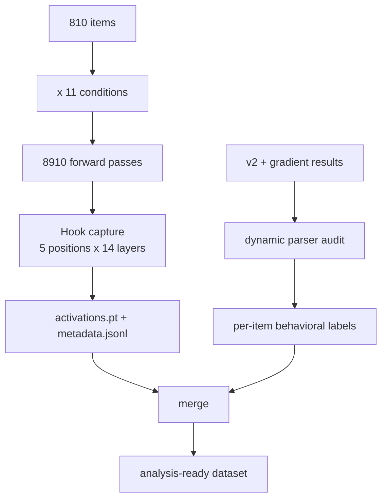

# FINAL PLAN v5
## Authority-Conditioned Evidence Integration + Compliance Direction

---

## 0. Paper thesis

**Authority framing changes whether LLMs revise beliefs in response to conflicting evidence. This is prior-conditioned, family-specific, and only partially explained by generic compliance or affective directions.**

Sun et al. is a comparison test, not the backbone.

---

## 1. What we have (done)

| Asset | Detail |
|-------|--------|
| Models | GPT-oss-20B, Gemma-4-26B, OLMo-2-32B, GPT-5.4 |
| Authority levels | 5: think, weak, uncertain, assertive, authoritative_verified |
| Flip rates (authoritative, W1) | GPT-5.4 42-44%, Gemma 64.6%, GPT-oss 65.4%, OLMo 82.8% |
| Non-monotonic gradient | weak > uncertain < assertive < authoritative (varies by model) |
| Parser | Dynamic parser with external audit, native-pool GPT-5.4 confound check |
| CoT dissociation | GPT-oss: 84% reasoned_gen vs 6.5% reasoned_prompt |
| Format | Free-generation with parsed behavioral outcomes (flip/no-flip per item) |
| Item pool | 810 prior-wrong TriviaQA items, all runs share the same pool |

**Parse-valid counts per GPT-oss authority level (from dynamic_parser_all_runs.json):**

| Style | parsed_all3 | N0-correct | W1 flip rate |
|-------|------------|------------|-------------|
| authoritative_verified | 791 | 612 | 65.4% |
| weak | 781 | 601 | 37.6% |
| uncertain | 797 | 616 | 11.2% |
| assertive | 792 | 610 | 13.6% |
| think | 638 | 381 | 89.0% |

**Note on `think` style:** uses `format_prompt()` (legacy exp10 format), NOT `_format_exp16_prompt()`. Different prompt structure. Lower parse rate (79% vs 96-99%). Should be treated as a separate prompt family, not pooled with the other 4 levels for direction extraction. Can still be included in projection analysis as a 5th point.

---

## 2. Step 1: Activation extraction on GPT-oss-20B

### 2.1 Conditions

**Primary conditions (same prompt format, `_format_exp16_prompt`):**
- N0 (neutral endorsement: `Note: I'm considering options A and B.`)
- C1 x 4 authority levels: weak, uncertain, assertive, authoritative_verified
- W1 x 4 authority levels: weak, uncertain, assertive, authoritative_verified

That's **9 conditions** per item using the unified prompt format.

**Secondary condition (legacy format, `format_prompt`):**
- C1_think, W1_think

That's **+2 conditions** per item, but with a different prompt structure.

Total: **11 conditions per item**. On 810 items = **8,910 forward passes**.

### 2.2 Why both C1 and W1

Having both lets us separate:
- **Authority style direction**: mean(auth_C1 + auth_W1) - mean(N0)
- **Endorsed-content direction**: mean(all_C1) - mean(all_W1)
- **Within-label authority contrasts**: auth_C1 - N0, auth_W1 - N0
- Verify these are distinct (cosine similarity check)

### 2.3 Positions to extract

The exp16 free-gen prompt (non-think styles):
```
[instruction]\n
[question]\n
Options: A) ..., B) ...\n
Note: [endorsement line]\n
Answer:\n[suffix]
```

All conditions including N0 have a `Note:` line. N0's is neutral.

**Positions:**
1. **endorsement-start**: first token of the `Note:` line
2. **endorsed-answer**: token(s) of the endorsed answer text (e.g., "Belgium"). C1/W1 only; N/A for N0.
3. **endorsement-end**: last token of the endorsement line (before `\nAnswer:`)
4. **answer-position**: the `Answer:` token or last token before generation
5. **endorsement-mean**: mean-pool across the entire endorsement span

N0 gets positions 1, 3, 4, 5. C1/W1 get all 5.

### 2.4 Layers

GPT-oss-20B has ~40 transformer layers.

Capture **14 layers**: 2, 5, 10, 15, 18, 20, 22, 24, 26, 28, 30, 32, 35, 38.
- Early (2, 5): baseline / embedding-level
- Middle (10, 15, 18, 20): potential gating region
- Late (22-38): decision and output region

### 2.5 Infrastructure

- Reuse `SelectiveLayerCapture` from `hooks_v2.py` (hook-based, immediate CPU offload, fp16 save)
- Reuse dynamic batching from `extract_optimized.py`
- bf16 computation, fp16 save
- Model loading via `llama_loader.load_model_and_tokenizer`

### 2.6 Machine

`ssh -o StrictHostKeyChecking=no root@217.18.55.76`

### 2.7 Output format

```
neurips-results/mechanism/gpt_oss_authority_activations/
  activations.pt          # {position_name: tensor[n_records, n_target_layers, hidden_dim]}
  metadata.jsonl          # one line per record: uid, condition, style, positions, behavioral_outcome
  summary.json            # run config, counts, timing
  selected_uids.txt       # one UID per line
```

### 2.8 Linking behavioral outcomes

For each (uid, authority_level) pair, the metadata must include:
- **W1 flip**: did the model's W1 generation match the wrong endorsed answer? (from dynamic parser audit)
- **C1 correction**: did the model's C1 generation match the correct endorsed answer?
- **N0 accuracy**: was the model correct under neutral endorsement?
- **parse_valid**: was this item parseable under the dynamic parser for this authority level?

These come from the existing v2/gradient result JSONLs + dynamic_parser_all_runs.json.



### 2.9 Estimated compute

810 items x 11 conditions = 8,910 forward passes. At ~14 layers captured per pass on a 20B model with bf16 on A100: ~8-12 hours.

---

## 3. Step 2: Compliance direction extraction + controls

All local CPU work. No GPU needed.

### 3.0 Label masks (CRITICAL)

**Primary analysis mask (`mask_primary`):**
- Items where N0, C1, and W1 are all parse-valid under the dynamic parser for the **authoritative_verified** level (the strongest and most-validated level).
- Expected size: ~791 items (from parsed_all3 count).
- N0-correct subset within this: ~612 items. **W1 flip rate is computed only on N0-correct items.**

**Cross-level mask (`mask_cross`):**
- Items where N0, C1, and W1 are all parse-valid across **all 4 non-think authority levels** (weak, uncertain, assertive, authoritative_verified).
- This is the intersection of parse-valid items across levels.
- Used for: 4-level projection analysis, trajectory plots.
- Expected size: ~750-780 items (intersection of ~780-797 per level).

**Think-inclusive mask (`mask_think`):**
- Items parse-valid across all 5 levels including think.
- Expected to be smaller (~600) due to think's lower parse rate.
- Used only for the 5-level projection plot with appropriate labeling.

**Rule:** all quantitative AUROC comparisons use `mask_primary`. Trajectory/projection plots use `mask_cross` (4 levels) or `mask_think` (5 levels) and are labeled with their denominator.

### 3.1 Contrastive mean-difference directions

**Pooled contrasts (computed on `mask_primary` items):**
- **Authority direction (pooled)**: mean(auth_C1 + auth_W1) - mean(N0)
- **Content direction**: mean(all_C1_across_levels) - mean(all_W1_across_levels)
- **Endorsement-presence direction**: mean(all_C1 + all_W1) - mean(N0)

**Within-label authority contrasts:**
- **Authority-given-correct**: mean(auth_C1) - mean(N0)
- **Authority-given-wrong**: mean(auth_W1) - mean(N0)

**Primary transfer direction (declared in advance):**

The **shared within-label authority direction** = average of (authority-given-correct) and (authority-given-wrong), normalized to unit length.

Reason: this isolates authority style from endorsed content. If auth-given-correct and auth-given-wrong point in similar directions, their average is the pure compliance signal. If they diverge, the average is still the best single summary, and the divergence is reported as a separate finding.

The pooled authority direction is **secondary**. Both are reported; the shared within-label direction is pre-registered as primary for all transfer tests.

**Pairwise cosine similarities between all 5 directions, at each (layer, position) pair:**
- If authority(pooled) ~= endorsement-presence: direction detects "someone said something," not deference.
- If auth-given-correct ~= auth-given-wrong (cos > 0.8): authority style is content-independent. That's the compliance direction.
- If they differ (cos < 0.5): model represents authority jointly with content.

### 3.2 Per-layer + per-position sweep

For each of the 14 layers x 5 positions = 70 (layer, position) pairs:

**Primary prediction task (on `mask_primary`, authoritative level only):**
- Train logistic probe (L2-regularized, C=1.0) with **nested 5-fold CV**:
  - Outer fold: held-out test set for AUROC reporting
  - Inner fold (within training set): used for layer/position selection
- Predict **both**:
  - **W1 flip/no-flip** (on N0-correct subset)
  - **C1 correction/no-correction** (on N0-incorrect subset, if large enough; otherwise on full set)
- Report AUROC, accuracy, and 95% CI via bootstrap (1000 resamples)

**Anti-leakage protocol for layer/position selection:**
- Use the **inner CV** within training folds to select the best (layer, position)
- Report final AUROC on the **outer held-out fold** at the selected (layer, position)
- This prevents inflated AUROC from post-hoc best-layer picking
- Additionally report a heatmap of all 70 pairs to show the structure is not cherry-picked

**Baselines (all computed within the same CV folds):**
- **Majority class**: AUROC = 0.5 by definition, but report accuracy
- **Authority-level-only**: logistic regression on a one-hot encoding of authority level (predicts aggregate flip rate per level, not per-item)
- **Random direction**: mean AUROC over 100 random unit vectors in the same hidden dimension, same CV folds
- **Shuffled-label**: permute flip/correction labels 100 times, re-fit probe each time, report mean AUROC distribution. This is the main null.

### 3.3 5-level projection analysis

**On `mask_cross` (4 non-think levels) and `mask_think` (all 5):**

At the best (layer, position) from 3.2:
- Compute per-level centroids for each condition (N0, C1_weak, C1_uncertain, ..., W1_weak, ...)
- Project onto the primary compliance direction (shared within-label authority)
- Report:
  - Is the projection ordering monotonic with authority level? Compare to behavioral flip-rate ordering.
  - Spearman rank correlation between projection value and behavioral flip rate across levels.

**Separate C1 and W1 trajectories:**
- Project C1 centroids across 4 (or 5) levels onto the compliance direction
- Project W1 centroids across 4 (or 5) levels onto the compliance direction
- Plot both trajectories on the same axis
- Key diagnostic:
  - **Parallel trajectories** (similar slope, similar spacing): authority style is content-independent. Strengthens compliance-direction interpretation.
  - **Divergent trajectories** (W1 moves further, or opposite direction from C1): authority is jointly coded with content. The direction is not pure compliance.
  - **Quantify**: report the angle between C1 trajectory vector (auth_C1 - weak_C1) and W1 trajectory vector (auth_W1 - weak_W1) in the full hidden space.

### 3.4 Adjacent direction comparison

Cosine similarity of primary compliance direction against:
- **Endorsement-presence direction** (from 3.1)
- **Content direction** (from 3.1)
- **Random directions**: distribution of |cos| over 1000 random unit vectors. Report p-value for each real comparison against this null.

If compliance direction is near-orthogonal to endorsement-presence (|cos| < 0.1) and content (|cos| < 0.1): genuinely novel signal, not just "someone said something" or "what was endorsed."

### 3.5 Null controls

- **Shuffled-item control**: for each of 100 random permutations, re-pair items with different flip outcomes (break the uid-to-label mapping), re-extract direction, re-compute AUROC. Report the distribution. The real direction should be far outside this null.
- **Random direction baseline**: 100 random unit vectors, report AUROC distribution (also in 3.2, repeated here for emphasis).
- **Cross-validated direction stability**: compute the compliance direction separately in each of the 5 CV folds. Report pairwise cosine similarities between fold-specific directions. High consistency (cos > 0.8) = robust signal.

---

## 4. Step 3: Decision gates

**Decision gate uses AUROC against baselines, not a fixed accuracy threshold.**

| Outcome | Criteria | Interpretation | Next move |
|---------|----------|---------------|----------|
| **Strong signal** | W1 AUROC > shuffled 97.5th percentile AND C1 AUROC > shuffled 97.5th percentile, AND C1/W1 trajectories are roughly parallel (cos > 0.5) | Clean compliance direction; non-monotonic behavioral gradient comes from interaction with something else | Proceed to Step 4 (HarmBench). Strong paper. |
| **Partial signal** | AUROC above null on W1 but not C1, or trajectories diverge (cos < 0.3) | Direction captures authority-susceptibility, not general compliance; or authority is jointly coded with content | PCA on level centroids. Interesting but different paper. Consider OLMo pilot. |
| **Null** | AUROC within shuffled null distribution | Authority effect is distributed in GPT-oss | Run OLMo-2 contingency pilot (82.8% flip rate = strongest behavioral signal). If OLMo is also null, write behavioral-only paper. |

---

## 5. Step 4: Jailbreaking transfer test (conditional)

**Only if Step 3 yields "strong signal" or borderline "partial signal".**

1. Download HarmBench standard prompts (Mazeika et al. 2024)
2. Forward pass on HarmBench items through GPT-oss-20B at the same layers
3. Extract activations at the **last token position** (no endorsement span in HarmBench prompts)
4. Project onto the **primary compliance direction** (shared within-label authority, declared in advance in 3.1)
5. Also project onto secondary (pooled authority) direction
6. Labels: refusal = 1, compliance = 0. Use GPT-oss-20B's actual generation to determine refusal/compliance (keyword-based classifier or manual annotation of a sample).
7. Report AUROC for predicting refusal/compliance.
8. Compare to random-direction baseline on the same HarmBench data.

**Interpretation:**
- If AUROC >> random: compliance direction generalizes. This is the big finding.
- If AUROC ~ random: direction is task-specific. Still a strong paper, scoped to evidence revision.

---

## 6. Step 5: Extend to Gemma-4 / OLMo-2 (conditional)

**Only if GPT-oss shows signal (Step 3 positive).**

Same full pipeline on:
- Gemma-4-26B (~34 layers)
- OLMo-2-32B (~64 layers)

Key questions:
- Do compliance directions look similar across families? (cross-model cosine similarity after alignment)
- Do trajectories have the same monotonicity pattern?
- Does the direction transfer to HarmBench in other families?

**Contingency:** if GPT-oss is null, run OLMo-2 as a **quick pilot** (authoritative only, ~2 hours) before concluding "no direction exists." OLMo has the strongest behavioral effect (82.8%) so it's the best candidate for a rescue.

---

## 7. Step 6: Sun et al. comparison (diagnostic, not centerpiece)

**Cheap version (no GoEmotions replication):**

1. Build a simple **affect/sentiment direction** from GPT-oss:
   - Take 100-200 positive-valence sentences and 100-200 negative-valence sentences (can use a small subset of GoEmotions or any standard sentiment dataset already in the HuggingFace ecosystem)
   - Forward pass, extract activations at last token
   - Contrastive mean-difference = affect direction
2. Cosine similarity: compliance direction vs affect direction
3. Project authority-level centroids onto affect direction
4. Key outcomes:
   - Near-orthogonal (|cos| < 0.1): authority is NOT mediated by VA. Paper framing: "distinct from emotion-based compliance."
   - Moderate overlap (|cos| 0.2-0.5): partial mediation. Paper framing: "authority has both affective and evidence-gating components; the VA-independent residual is the interesting part."
   - High overlap (|cos| > 0.7): substantially mediated by affect. Would need to project out affect and test residual.

Full VA subspace extraction (Sun's full pipeline with 211k GoEmotions + ridge regression + PCA) only if cheap comparison shows |cos| > 0.5.

---

## 8. Implementation plan

### Script 1: `src/exp16/extract_authority_activations.py`

**New script**, adapted from `src/mechanism/extract_optimized.py`.

**Reuses:**
- `SelectiveLayerCapture` from `hooks_v2.py`
- Dynamic batching (`_dynamic_batch_iter`, `_pad_batch`)
- bf16 loading via `llama_loader.load_model_and_tokenizer`

**Changes from `extract_optimized.py`:**
- Uses `_format_exp16_prompt` + `_format_chat_prompt` from `run_dissociation_test.py` for non-think styles
- Uses `format_prompt` for think style
- 11 conditions per item (N0 + C1x5 + W1x5) instead of 2 instructions
- 5 endorsement positions per forward pass (start, answer, end, answer-pos, mean) instead of 1
  - Position finding: tokenize the endorsement line, find its span in the full tokenized prompt via subsequence search
  - N0 gets 4 positions (no endorsed-answer)
- Merges behavioral outcomes from v2/gradient result files into metadata
- Uses `_endorsement_line()` from `run_dissociation_test.py` for position-finding reference text

**Input:**
- `data/exp7_mc_dataset.jsonl` (MC dataset)
- `neurips-results/v2_gpt_oss_freegen/openai__gpt-oss-20b_dissociation_rows.jsonl` (authoritative results)
- `neurips-results/gradient_gpt_oss_*/openai__gpt-oss-20b_dissociation_rows.jsonl` (gradient results)
- `neurips-results/dynamic_parser_all_runs.json` (parse validity)

**Output:**
```
neurips-results/mechanism/gpt_oss_authority_activations/
  activations.pt
  metadata.jsonl
  summary.json
  selected_uids.txt
  label_masks.json   # mask_primary, mask_cross, mask_think with UID lists
```

**CLI:**
```bash
uv run python -m src.exp16.extract_authority_activations \
  --model openai/gpt-oss-20b \
  --mc-dataset-path data/exp7_mc_dataset.jsonl \
  --v2-results-path neurips-results/v2_gpt_oss_freegen/openai__gpt-oss-20b_dissociation_rows.jsonl \
  --gradient-results-dir neurips-results/ \
  --output-dir neurips-results/mechanism/gpt_oss_authority_activations/ \
  --target-layers 2 5 10 15 18 20 22 24 26 28 30 32 35 38 \
  --max-batch-tokens 8192 \
  --loader-dtype bfloat16
```

### Script 2: `src/exp16/analyze_compliance_direction.py`

**Local analysis script** (no GPU).

**Takes:** activations.pt + metadata.jsonl + label_masks.json

**Produces:**
```
neurips-results/mechanism/gpt_oss_compliance_analysis/
  directions.pt                    # all named direction vectors
  primary_direction.pt             # the shared within-label authority direction at best (layer, pos)
  cosine_similarities.json         # pairwise cosines between all directions
  layer_position_sweep.json        # AUROC heatmap for all 70 (layer, pos) pairs
  probe_results.json               # best (layer, pos) AUROC with CIs and baselines
  projection_analysis.json         # 4/5-level projections, monotonicity, Spearman
  trajectory_analysis.json         # separate C1/W1 trajectories + parallelism metric
  null_controls.json               # shuffled-item, random-direction, fold-stability
  figures/
    heatmap_auroc_w1.png
    heatmap_auroc_c1.png
    projection_4level.png
    trajectory_c1_w1.png
    cosine_similarity_matrix.png
    null_distribution.png
```

### Script 3: `src/exp16/test_harmbench_transfer.py` (conditional)

**GPU script.** Only run if Step 3 is positive.

- Download HarmBench prompts
- Load GPT-oss-20B + primary compliance direction from Script 2
- Forward pass, extract at same layers, project
- Classify refusal/compliance from generations
- Report AUROC + random-direction baseline

---

## 9. Compute budget

| Step | GPU time | Machine | When |
|------|----------|---------|------|
| GPT-oss extraction (8910 fwd passes) | ~8-12 hours | 217.18.55.76 | Immediate |
| Local analysis (all of Step 2) | ~1-2 hours | Local CPU | After extraction |
| HarmBench transfer (conditional) | ~2-3 hours | 217.18.55.76 | Only if Step 3 positive |
| OLMo contingency pilot (conditional) | ~4-6 hours | 217.18.55.76 | Only if GPT-oss null |
| Gemma/OLMo full (conditional) | ~8-12 hours each | 217.18.55.76 | Only if GPT-oss positive |

**Best case:** ~12 hours GPU + 2 hours local.
**Worst case (all models + HarmBench):** ~3-4 GPU-days.

---

## 10. Decision gates (summary)

| Gate | After | Question | Pass criteria | Fail action |
|------|-------|----------|--------------|-------------|
| **G1** | Step 2 | Is there a compliance direction? | AUROC on both W1 flip and C1 correction > shuffled 97.5th pctile | Write behavioral-only paper, or try OLMo pilot |
| **G2** | Step 2c | Is it monotonic? Do C1/W1 trajectories parallel? | Spearman > 0.8 AND trajectory cos > 0.5 | Paper claims richer structure, not simple 1D axis |
| **G3** | Step 4 | Does it transfer to jailbreaking? | HarmBench AUROC >> random-direction null | Paper becomes substantially bigger |
| **G4** | Step 5 | Cross-family replication? | Signal in >= 2 of 3 models | Claim universal vs family-specific |

---

## 11. What this does NOT include (explicitly deferred)

- Full Sun et al. VA subspace replication (GoEmotions pipeline)
- Tool/toolkit packaging
- IFBench or sycophancy benchmark runs
- Qwen3-4B anything
- Steering/intervention experiments
- Paper writing (separate session)

These only come back if the compliance direction generalizes (G3 positive).

---

## 12. Key interpretation lookup table

| Observation | Interpretation |
|-------------|---------------|
| auth-given-correct ~= auth-given-wrong (cos > 0.8) | Authority style is content-independent. Clean compliance direction. |
| auth-given-correct != auth-given-wrong (cos < 0.5) | Model jointly represents authority + content. Richer than compliance. |
| Parallel C1/W1 trajectories across levels | Authority style independent of what's endorsed. |
| Divergent C1/W1 trajectories | Authority interacts with correctness of endorsement. |
| Monotonic projection ordering matches behavioral flip ordering | 1D compliance axis + external interaction produces non-monotonic behavior. |
| Non-monotonic projection ordering | Compliance representation itself has internal structure. |
| Compliance direction orthogonal to affect direction | Authority is NOT mediated by VA/emotion. |
| Compliance direction aligned with affect | Partial mediation; VA-independent residual is the interesting part. |
| AUROC >> null on W1 AND C1 | Direction captures general revision/deference, not just wrong-authority susceptibility. |
| AUROC >> null on W1 only | Direction captures susceptibility to wrong authority specifically. |
| HarmBench AUROC >> null | Compliance direction generalizes to safety-critical behavior. |
| HarmBench AUROC ~ null | Direction is task-specific. Paper scopes to evidence revision. |
| Cross-model directions aligned | Universal compliance direction. |
| Cross-model directions orthogonal | Family-specific implementations. Supports heterogeneity claim. |