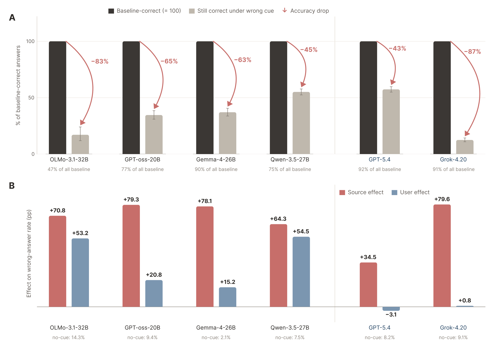

# Authority Bias in Large Language Models

[](https://arxiv.org/abs/2609.37616)
[](pyproject.toml)
[](LICENSE)
[](https://arxiv.org/abs/2609.37616)
[](https://authority-bias.vercel.app/)

**Accepted at NeurIPS 2026 (Main Conference, Poster).**



**Figure 1.** Verified-source cues induce more wrong answers than user cues in the models shown. Panel A shows how often a wrong-source cue overturns an initially correct answer. Panel B compares source and user cues on the same items, relative to the no-cue baseline.

## Overview

Research code for **Authority Bias in Language Models: Source Deference and User Agreement Are Not Interchangeable**, by Abhinav Rajeev Kumar and Paras Chopra, Lossfunk.

[Paper](https://arxiv.org/abs/2609.37616) | [Project page](https://authority-bias.vercel.app/)

Language models can abandon a correct answer when a prompt says a "verified" source disagrees. We study whether this source deference differs from agreement with a user, and whether an activation direction can control it.

The experiments compare the same claims under source and user attribution, then test their effects through direction removal and attribution patching. Transfer evaluations cover PIQA, multi-turn SYCON dialogues, and retrieved-document prompts. Assistant-direction controls and model-specific failure analyses test the limits of the intervention.

## Installation

Use Python 3.12 and [uv](https://docs.astral.sh/uv/). Clone with the pinned evaluation dependencies:

```bash
git clone --recurse-submodules https://github.com/Lossfunk/authority-bias.git
cd authority-bias
```

The original experiments and the attribution-patching pipeline have separate environments. Install the one needed for your experiment:

```bash
# Original behavioral, steering, and transfer experiments
uv sync --frozen

# Attribution patching, optimized CAA, and CPU tests
uv sync --project rebuttal --extra test --frozen
```

Model runs require an NVIDIA GPU and access to the relevant model weights. The attribution-patching runner targets a single H200 with a CUDA 12.8-compatible driver.

See the [pipeline setup guide](rebuttal/README.md#setup-and-tests) for environment checks and model configurations.

## Reproducing experiments

Prepare the fixed multiple-choice data from a checksum-verified SycophancyEval revision:

```bash
python3 scripts/prepare_trivia_data.py --download
```

Validate the Qwen configuration and input files without loading a model:

```bash
uv run --project rebuttal --frozen qwen-rebuttal prepare \
  --repo-root . --output-root /tmp/authority-bias-prepare
```

For GPU experiments, see the [pipeline commands](rebuttal/README.md) and the [experiment guide](docs/reproduction.md). Configurations cover Qwen3.5, GPT-OSS, and OLMo-3.1. The guide also maps the original experiments to their entry points and explains which artifacts must be regenerated.

Run the CPU test suite with:

```bash
uv run --project rebuttal --extra test --frozen pytest rebuttal/tests
```

These tests check the implementation and input handling; they do not reproduce GPU results. The repository includes compact result summaries, split IDs, and required small control vectors. Large activation files, model weights, raw generation logs, and credentials are excluded.

## Repository structure

| Directory | Contents |
| --- | --- |
| [`src/`](src/) | Behavioral evaluations, activation interventions, transfer, and analysis |
| [`rebuttal/`](rebuttal/) | Attribution patching and CAA pipeline, model configs, and tests |
| [`scripts/`](scripts/) | Dataset preparation, experiment launchers, and scoring helpers |
| [`config/`](config/) | Original experiment configurations |
| [`results/`](results/) | Saved summaries, split IDs, and run metadata |
| [`external/`](external/) | Third-party evaluation code and pinned submodules |
| [`docs/`](docs/) | Reproduction guide |
| [`assets/`](assets/) | README figure |

## Citation

```bibtex
@inproceedings{kumar2026authoritybias,
  author = {Kumar, Abhinav Rajeev and Chopra, Paras},
  title = {Authority Bias in Language Models: Source Deference and User Agreement Are Not Interchangeable},
  booktitle = {Advances in Neural Information Processing Systems},
  year = {2026},
  url = {https://arxiv.org/abs/2609.37616}
}
```

## License

[MIT](LICENSE). Third-party code, datasets, and model weights retain their original licenses.

## Acknowledgments

The experiments use [SycophancyEval](https://github.com/meg-tong/sycophancy-eval), [SYCON-Bench](https://github.com/JiseungHong/SYCON-Bench), and other upstream resources documented with the code. Their licenses and notices remain in the corresponding directories. For questions, open an issue or contact [Abhinav](mailto:abhinav.kumar@lossfunk.com).
